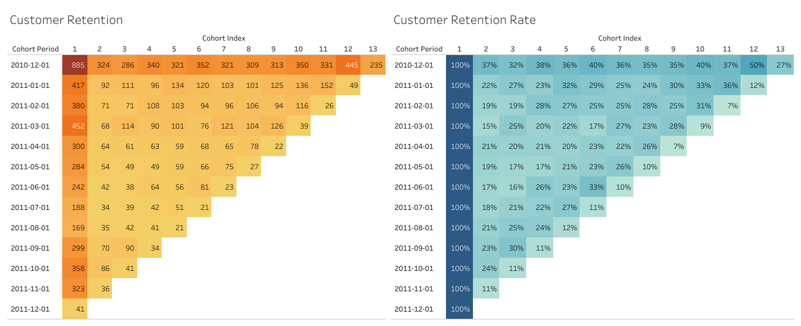

# Online Retail Customer Retention Analysis

## Overview

This project involves a cohort analysis to examine the customer retention rate for an online retail store. The data was obtained from the [UCI Machine Learning Repository](https://archive.ics.uci.edu/dataset/352/online+retail). The analysis includes data cleaning, exploration, transformation, and the creation of a Tableau visualization.

## Data Loading and Database Setup

The data was loaded into a PostgreSQL database using the following table creation command:

```sql
CREATE TABLE retail.online_retail (
    invoice_no VARCHAR(255),
    stock_code VARCHAR(255),
    description VARCHAR(255),
    quantity INT,
    invoice_date DATE,
    unit_price FLOAT,
    customer_id INT,
    country VARCHAR(255)
);
```

## Data Cleaning

### Checking Data Shape

```sql
-- 541,909 records in the table
SELECT COUNT(*) FROM retail.online_retail;
```

### Checking for Nulls

```sql
-- Checking for nulls in each column
DO $$ 
DECLARE 
    col_name TEXT;
    null_count INTEGER;
BEGIN
    FOR col_name IN (SELECT column_name FROM information_schema.columns WHERE table_name = 'online_retail') LOOP
        EXECUTE 'SELECT COUNT(*) FROM online_retail WHERE ' || col_name || ' IS NULL' INTO null_count;
        RAISE NOTICE 'Column % has % null values', col_name, null_count;
    END LOOP;
END $$;
```

### Removing Nulls and Duplicates

```sql
-- Removing records with nulls, 0 values, and duplicates
CREATE TEMP TABLE c_online_retail AS
WITH online_retail_1 AS (
    SELECT *
    FROM retail.online_retail
    WHERE customer_id IS NOT NULL AND quantity > 0 AND unit_price > 0
),
duplicate_check AS (
    SELECT *, ROW_NUMBER() OVER (PARTITION BY invoice_no, stock_code, quantity ORDER BY invoice_date) AS duplicate_flag
    FROM online_retail_1
)
SELECT * 
FROM duplicate_check
WHERE duplicate_flag = 1;
```

## Cohort Analysis

### Prepare Retention Analysis Data

```sql
-- Create cohort and store in a temp table
CREATE TEMP TABLE cohort_data AS
SELECT customer_id, MIN(invoice_date) AS first_purchase, DATE_TRUNC('month', MIN(invoice_date)) AS cohort
FROM c_online_retail
GROUP BY customer_id;

-- Create cohort index and save to a temporary table
CREATE TEMP TABLE retention_data AS
WITH year_month AS (
    SELECT 
        r.*,
        c.cohort,
        DATE_PART('year', r.invoice_date) AS invoice_year,
        DATE_PART('month', r.invoice_date) AS invoice_month,
        DATE_PART('year', c.cohort) AS cohort_year,
        DATE_PART('month', c.cohort) AS cohort_month
    FROM c_online_retail r
    LEFT JOIN cohort_data c ON r.customer_id = c.customer_id
),
diffs AS (
    SELECT *, (invoice_year - cohort_year) AS year_diff, 
            (invoice_month - cohort_month) AS month_diff
    FROM year_month
)
SELECT *, (year_diff * 12 + month_diff + 1) AS cohort_index 
FROM diffs;

-- Export the retention_data table for Tableau visualization
SELECT * FROM retention_data;
```

## Tableau Visualization

The Tableau visualization dashboard for this project can be found [here](https://public.tableau.com/app/profile/victor.essien.essien/viz/CustomerRetention-CohortAnalysis/Dashboard1).


